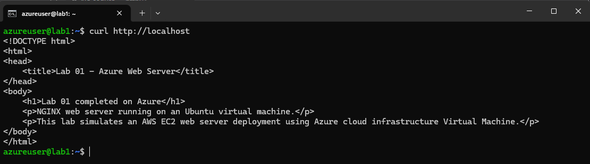
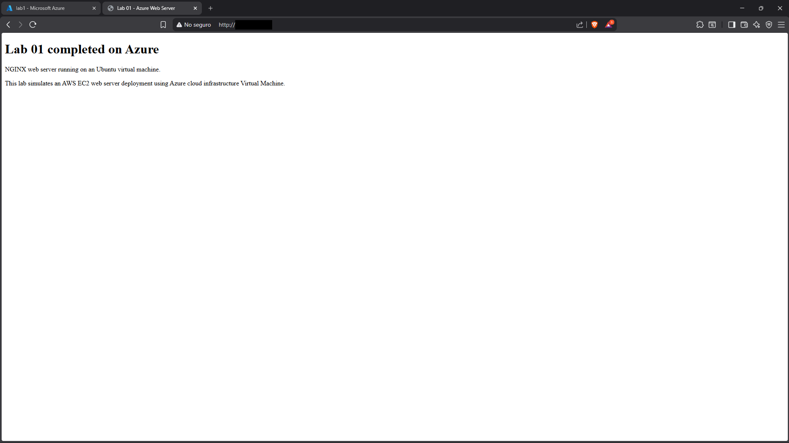
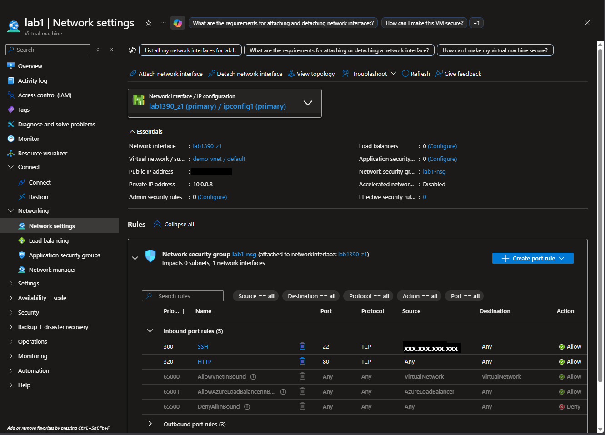

# Lab 01 - Azure VM NGINX Web Server

## Overview

This lab demonstrates how to deploy a basic web server using an Azure Virtual Machine running Ubuntu Server and NGINX.

This lab maps Azure VM concepts to AWS EC2 concepts to practice cloud compute, networking, SSH access, firewall rules, and web server deployment.

## Architecture

- Azure Virtual Machine
- Ubuntu Server
- Network Security Group
- Public IP Address
- SSH access using private key authentication
- NGINX Web Server

## Azure to AWS Comparison

| Azure | AWS |
|---|---|
| Virtual Machine | EC2 Instance |
| Network Security Group | Security Group |
| Virtual Network | VPC |
| Public IP Address | Public IPv4 / Elastic IP |
| SSH Key | EC2 Key Pair |
| Resource Group | Similar to organizing resources with tags |

## Steps Performed

1. Created an Azure Virtual Machine.
2. Configured SSH access using a private key.
3. Assigned a Public IP Address to the VM.
4. Configured inbound Network Security Group rules for SSH and HTTP.
5. Connected to the VM using SSH.
6. Installed NGINX.
7. Enabled and started the NGINX service.
8. Replaced the default NGINX page with a custom HTML page.
9. Tested the web server locally and from a browser.

## Commands Used

```bash
sudo apt update
sudo apt install -y nginx
sudo systemctl enable nginx
sudo systemctl start nginx
sudo systemctl status nginx --no-pager
curl http://localhost
```

## Custom Web Page

The custom HTML page was deployed to:

```bash
/var/www/html/index.html
```

The file is included in this lab as:

```text
index.html
```

## Screenshots

### NGINX Service Status


### Local Curl Test



### Browser Test



### Azure Network Security Group Rules



## What I Learned

- How to create and access a Linux virtual machine in Azure.
- The difference between private and public IP addresses.
- How to connect to a cloud server using SSH.
- How inbound firewall rules control access to cloud resources.
- How to install and manage NGINX on Ubuntu.
- How Azure VM concepts map to AWS EC2 concepts.
- How to troubleshoot common SSH and public IP issues.
