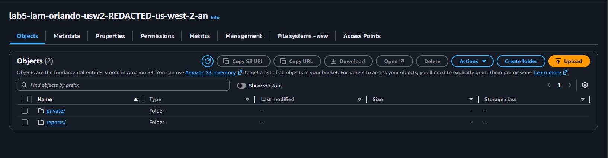
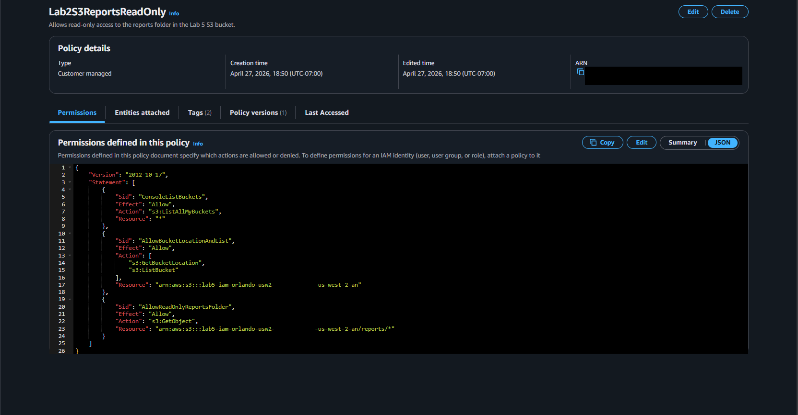
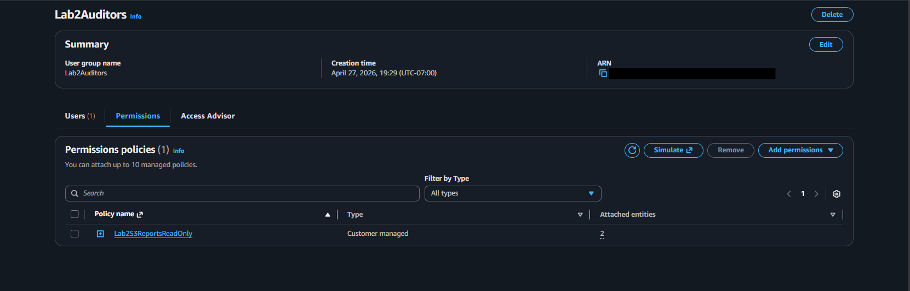
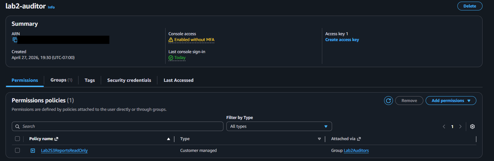
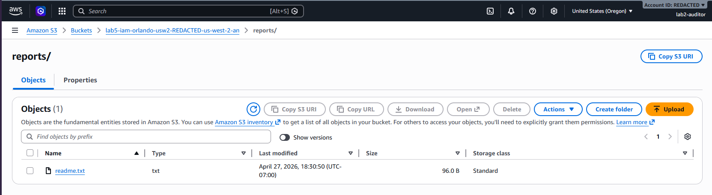
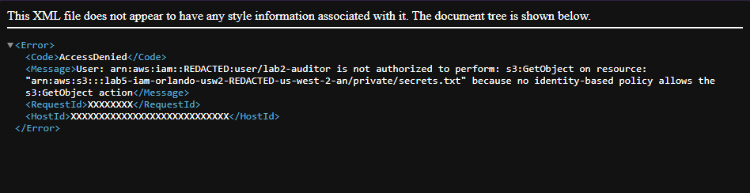
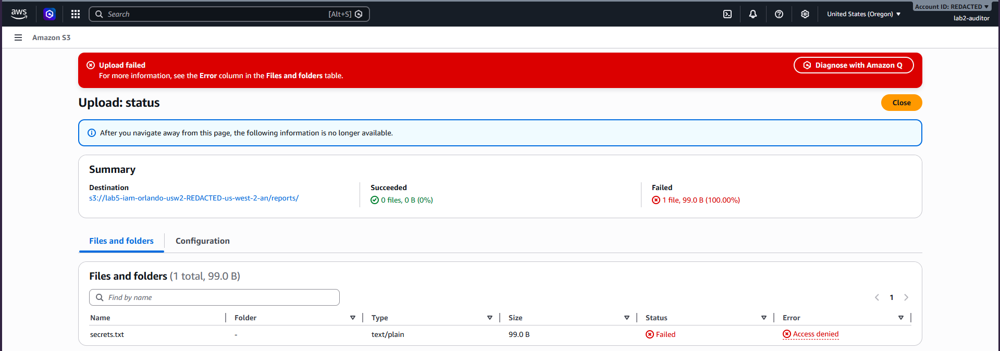
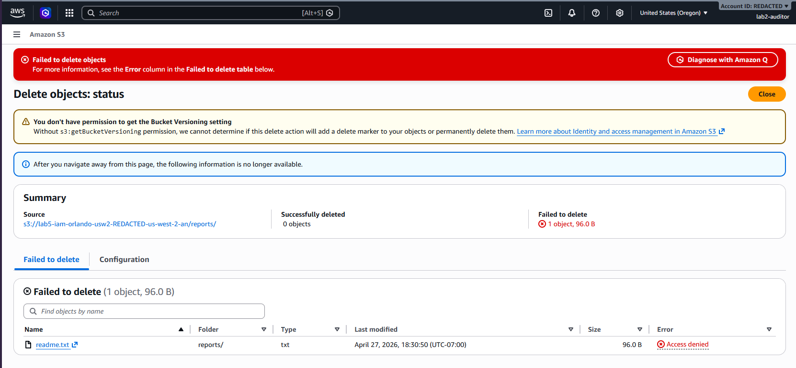
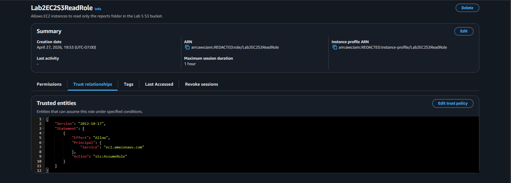
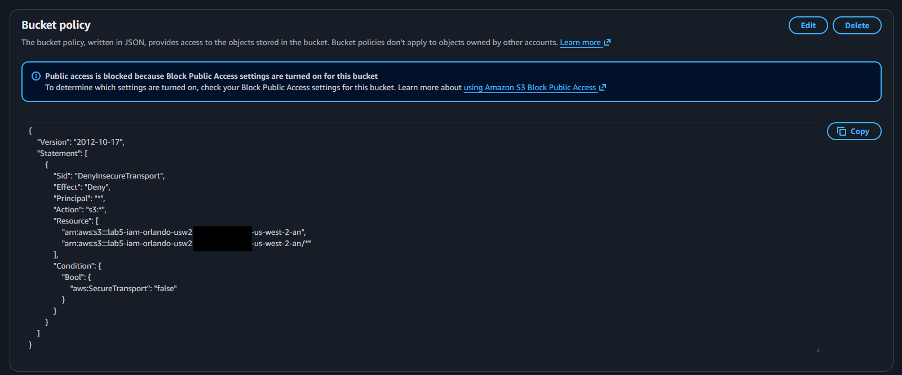

# Lab 02 - AWS IAM Least Privilege Access to S3

## Overview

This lab demonstrates how to configure least-privilege access to an Amazon S3 bucket using AWS IAM.

The goal was to create an IAM user that can read files only from a specific S3 prefix named `reports/`, while being denied access to private files, uploads, and deletes.

This lab also includes an IAM role for EC2 and an S3 bucket policy that denies insecure non-HTTPS requests.

## Architecture

- Amazon S3 Bucket
- IAM User
- IAM Group
- IAM Customer Managed Policy
- IAM Role for EC2
- S3 Bucket Policy
- Block Public Access
- Server-side encryption with SSE-S3

## IAM Access Design

| Component | Purpose |
|---|---|
| IAM User | Test user used to validate permissions |
| IAM Group | Central place to manage auditor permissions |
| IAM Policy | Allows read-only access to `reports/` |
| IAM Role | Allows EC2 to access S3 without access keys |
| Bucket Policy | Denies non-HTTPS requests to the bucket |

## Steps Performed

1. Created a private Amazon S3 bucket.
2. Enabled Block Public Access.
3. Disabled ACLs.
4. Created two S3 prefixes: `reports/` and `private/`.
5. Uploaded a test file to `reports/`.
6. Uploaded a private test file to `private/`.
7. Created a custom IAM policy with read-only access to `reports/`.
8. Created an IAM group named `Lab5Auditors`.
9. Attached the custom IAM policy to the IAM group.
10. Created an IAM user named `lab5-auditor`.
11. Added the IAM user to the `Lab5Auditors` group.
12. Tested allowed and denied S3 actions using the auditor user.
13. Created an IAM role for EC2.
14. Reviewed the EC2 role trust policy.
15. Added an S3 bucket policy to deny insecure HTTP requests.

## IAM Policy Used

The custom IAM policy allowed the auditor user to list the bucket and read objects only inside the `reports/` prefix.

Account-specific details were redacted.

```json
{
  "Version": "2012-10-17",
  "Statement": [
    {
      "Sid": "ConsoleListBuckets",
      "Effect": "Allow",
      "Action": "s3:ListAllMyBuckets",
      "Resource": "*"
    },
    {
      "Sid": "AllowBucketLocationAndList",
      "Effect": "Allow",
      "Action": [
        "s3:GetBucketLocation",
        "s3:ListBucket"
      ],
      "Resource": "arn:aws:s3:::lab5-iam-orlando-usw2-REDACTED-us-west-2-an"
    },
    {
      "Sid": "AllowReadOnlyReportsFolder",
      "Effect": "Allow",
      "Action": "s3:GetObject",
      "Resource": "arn:aws:s3:::lab5-iam-orlando-usw2-REDACTED-us-west-2-an/reports/*"
    }
  ]
}
```

## Permission Tests

| Test | Result |
|---|---|
| Open `reports/readme.txt` | Allowed |
| Open `private/secrets.txt` | Access Denied |
| Upload a new file | Access Denied |
| Delete `reports/readme.txt` | Access Denied |

## EC2 IAM Role

An IAM role was created for EC2 to demonstrate how AWS services can access other AWS services without storing long-term access keys.

The trust policy allows EC2 to assume the role.

```json
{
  "Version": "2012-10-17",
  "Statement": [
    {
      "Effect": "Allow",
      "Principal": {
        "Service": "ec2.amazonaws.com"
      },
      "Action": "sts:AssumeRole"
    }
  ]
}
```

## S3 Bucket Policy

A bucket policy was added to deny requests that do not use HTTPS.

```json
{
  "Version": "2012-10-17",
  "Statement": [
    {
      "Sid": "DenyInsecureTransport",
      "Effect": "Deny",
      "Principal": "*",
      "Action": "s3:*",
      "Resource": [
        "arn:aws:s3:::lab5-iam-orlando-usw2-REDACTED-us-west-2-an",
        "arn:aws:s3:::lab5-iam-orlando-usw2-REDACTED-us-west-2-an/*"
      ],
      "Condition": {
        "Bool": {
          "aws:SecureTransport": "false"
        }
      }
    }
  ]
}
```

## Screenshots

### S3 Bucket Folders



### IAM Policy JSON



### IAM Group Policy



### IAM User Group Membership



### Reports Access Success



### Private Access Denied



### Upload Access Denied



### Delete Access Denied



### EC2 Role Trust Policy



### S3 Bucket Policy



## What I Learned

- How to create a private S3 bucket.
- How to use IAM users, groups, and policies.
- How to apply least-privilege access to S3.
- The difference between `s3:ListBucket`, `s3:GetObject`, `s3:PutObject`, and `s3:DeleteObject`.
- How implicit deny works in AWS IAM.
- How explicit deny overrides allow.
- The difference between identity-based policies and resource-based policies.
- How IAM roles allow EC2 to access AWS services without long-term access keys.
- How a trust policy controls who can assume an IAM role.
- How to enforce HTTPS access to an S3 bucket using a bucket policy.

