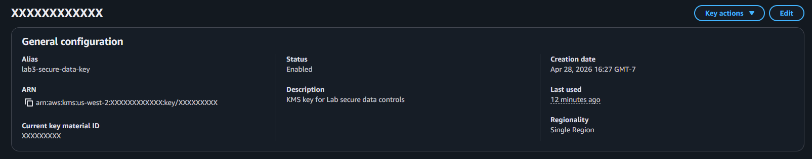
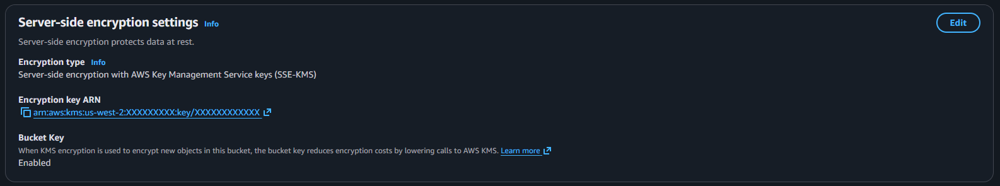
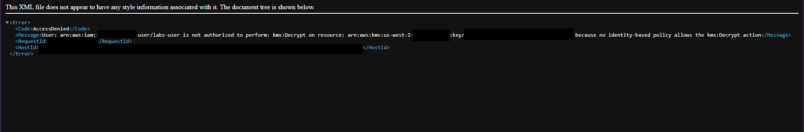
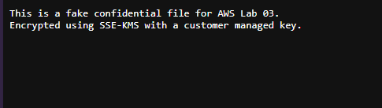
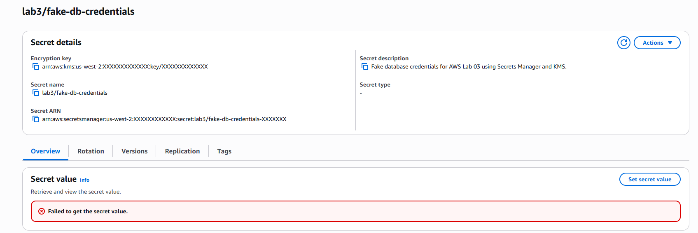
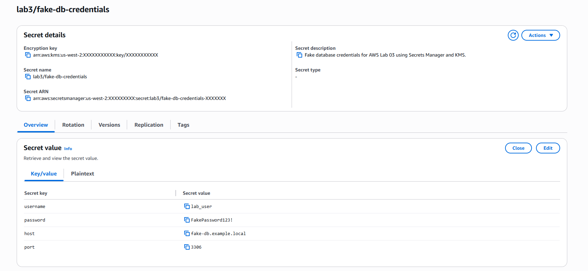

# Lab 03 - AWS KMS, Secrets Manager, and Secure Data Controls

## Overview

This lab demonstrates how to protect sensitive data in AWS using AWS Key Management Service (KMS), Amazon S3 server-side encryption with KMS (SSE-KMS), AWS Secrets Manager, and IAM least-privilege permissions.

The main goal was to prove that access to encrypted data requires both service-level permissions and KMS permissions.

A user can have permission to access an S3 object, but if the object is encrypted with a customer managed KMS key and the user does not have `kms:Decrypt`, access is denied.

This lab also demonstrates that a user can view Secrets Manager metadata but still be denied access to the actual secret value without `secretsmanager:GetSecretValue`.

## Architecture

- AWS KMS Customer Managed Key
- Amazon S3 Bucket
- S3 Object encrypted with SSE-KMS
- AWS Secrets Manager secret
- IAM User for permission testing
- IAM Inline Policies
- S3 Bucket Key enabled for SSE-KMS cost optimization

## Security Access Design

| Component | Purpose |
|---|---|
| KMS Customer Managed Key | Encrypt and decrypt protected data used by S3 and Secrets Manager |
| S3 Object | Stores a fake confidential file encrypted with SSE-KMS |
| Secrets Manager Secret | Stores fake database credentials encrypted with the KMS key |
| IAM User | Test user used to validate allowed and denied access |
| IAM Policies | Grant S3, KMS, and Secrets Manager permissions in controlled steps |
| S3 Bucket Key | Reduces AWS KMS request costs for SSE-KMS encrypted S3 objects |

## Steps Performed

1. Created a customer managed KMS key.
2. Configured the key as symmetric, single-region, and enabled for encrypt/decrypt usage.
3. Uploaded a fake confidential file to Amazon S3.
4. Configured the S3 object to use server-side encryption with AWS KMS (SSE-KMS).
5. Enabled S3 Bucket Key for the SSE-KMS encrypted object.
6. Created an IAM permission policy allowing the test user to access the S3 object without KMS decrypt permissions.
7. Confirmed that the user received an access denied error because `kms:Decrypt` was missing.
8. Added `kms:Decrypt` and `kms:DescribeKey` permissions for the KMS key.
9. Confirmed that the user could successfully read the encrypted S3 object.
10. Created a fake database credentials secret in AWS Secrets Manager.
11. Encrypted the secret using the same customer managed KMS key.
12. Granted the user metadata-only access to Secrets Manager.
13. Confirmed that the user could not retrieve the secret value without `secretsmanager:GetSecretValue`.
14. Added `secretsmanager:GetSecretValue` permission.
15. Confirmed that the user could successfully retrieve the fake secret value.
16. Cleaned up lab resources to avoid unnecessary charges.

## KMS Key Configuration

A customer managed KMS key was created for this lab.

Account-specific values were redacted.

| Setting | Value |
|---|---|
| Key type | Symmetric |
| Key usage | Encrypt and decrypt |
| Regionality | Single Region |
| Alias | `lab3-secure-data-key` |
| Status | Enabled |

## S3 Object Encryption

The S3 object was encrypted using SSE-KMS with the customer managed KMS key.

| Setting | Value |
|---|---|
| Encryption type | SSE-KMS |
| KMS key | Customer managed KMS key |
| S3 Bucket Key | Enabled |

## IAM Policies Used

### S3 read access without KMS decrypt

This policy allowed the test user to list the bucket and read objects inside the lab prefix. It intentionally did not include `kms:Decrypt`.

```json
{
  "Version": "2012-10-17",
  "Statement": [
    {
      "Sid": "AllowS3ConsoleBucketList",
      "Effect": "Allow",
      "Action": [
        "s3:ListAllMyBuckets",
        "s3:GetBucketLocation"
      ],
      "Resource": "*"
    },
    {
      "Sid": "AllowListThisBucket",
      "Effect": "Allow",
      "Action": "s3:ListBucket",
      "Resource": "arn:aws:s3:::YOUR-BUCKET-NAME"
    },
    {
      "Sid": "AllowReadOnlyLab3KMSFolder",
      "Effect": "Allow",
      "Action": [
        "s3:GetObject",
        "s3:GetObjectAttributes",
        "s3:GetObjectTagging"
      ],
      "Resource": "arn:aws:s3:::YOUR-BUCKET-NAME/lab3-kms/*"
    }
  ]
}
```

### KMS decrypt permission

This policy allowed the test user to decrypt data encrypted with the lab KMS key.

```json
{
  "Version": "2012-10-17",
  "Statement": [
    {
      "Sid": "AllowDecryptWithLab3KMSKey",
      "Effect": "Allow",
      "Action": [
        "kms:Decrypt",
        "kms:DescribeKey"
      ],
      "Resource": "arn:aws:kms:us-west-2:ACCOUNT-ID:key/KEY-ID"
    }
  ]
}
```

### Secrets Manager metadata-only permission

This policy allowed the user to list secrets and describe the lab secret, but not retrieve the secret value.

```json
{
  "Version": "2012-10-17",
  "Statement": [
    {
      "Sid": "AllowSecretsManagerConsoleList",
      "Effect": "Allow",
      "Action": [
        "secretsmanager:ListSecrets"
      ],
      "Resource": "*"
    },
    {
      "Sid": "AllowDescribeOnlyForLab3Secret",
      "Effect": "Allow",
      "Action": [
        "secretsmanager:DescribeSecret"
      ],
      "Resource": "arn:aws:secretsmanager:us-west-2:ACCOUNT-ID:secret:lab3/fake-db-credentials-*"
    }
  ]
}
```

### Secrets Manager read permission

This policy allowed the user to retrieve the fake secret value.

```json
{
  "Version": "2012-10-17",
  "Statement": [
    {
      "Sid": "AllowReadLab3SecretValue",
      "Effect": "Allow",
      "Action": [
        "secretsmanager:GetSecretValue",
        "secretsmanager:DescribeSecret"
      ],
      "Resource": "arn:aws:secretsmanager:us-west-2:ACCOUNT-ID:secret:lab3/fake-db-credentials-*"
    }
  ]
}
```

## Permission Tests

| Test | Result |
|---|---|
| Open S3 object without `kms:Decrypt` | Access Denied |
| Open S3 object after adding `kms:Decrypt` | Allowed |
| View Secrets Manager metadata | Allowed |
| Retrieve secret value without `secretsmanager:GetSecretValue` | Access Denied |
| Retrieve secret value after adding `secretsmanager:GetSecretValue` | Allowed |

## S3 + KMS Test Result

The test user had S3 read access but did not have KMS decrypt access.

Result:

```text
AccessDenied: not authorized to perform kms:Decrypt
```

This confirmed that `s3:GetObject` alone is not enough to read an SSE-KMS encrypted object.

After adding `kms:Decrypt`, the user was able to read the encrypted file successfully.

## Secrets Manager Test Result

The test user was allowed to view the secret metadata, but was not allowed to retrieve the secret value.

Result:

```text
Failed to get the secret value.
```

After adding `secretsmanager:GetSecretValue`, the user was able to retrieve the fake database credentials.

## Screenshots

### KMS Key Created



### S3 Object Encrypted with SSE-KMS



### S3 Access Denied Without KMS Decrypt



### S3 Access Successful After Adding KMS Decrypt



### Secrets Manager Access Denied



### Secret Value Retrieved Successfully



## Secrets Manager vs Parameter Store

| Service | Best Use Case |
|---|---|
| Secrets Manager | Database passwords, API keys, service credentials, tokens, and secrets that may require automatic rotation |
| Systems Manager Parameter Store | Application configuration values, environment variables, feature flags, URLs, and non-sensitive parameters |

Secrets Manager is the better option for sensitive credentials that need stronger lifecycle management or automatic rotation.

Parameter Store is useful for general configuration data and can also store encrypted values as `SecureString`, but Secrets Manager is designed specifically for secret management.

## Cleanup

To avoid unnecessary charges, the following cleanup steps were performed:

1. Deleted the fake secret from AWS Secrets Manager.
2. Deleted the SSE-KMS encrypted object from S3.
3. Scheduled deletion for the customer managed KMS key.
4. Removed temporary IAM inline policies from the test user.

## What I Learned

- How to create a customer managed KMS key.
- How to encrypt S3 objects using SSE-KMS.
- How S3 permissions and KMS permissions are evaluated separately.
- Why `s3:GetObject` alone is not enough for SSE-KMS encrypted objects.
- How `kms:Decrypt` controls access to encrypted data.
- How to store structured fake credentials in AWS Secrets Manager.
- How Secrets Manager permissions and KMS permissions work together.
- Why `secretsmanager:GetSecretValue` is required to retrieve secret values.
- The difference between Secrets Manager and Parameter Store.
- How to document access denied scenarios as portfolio evidence.
